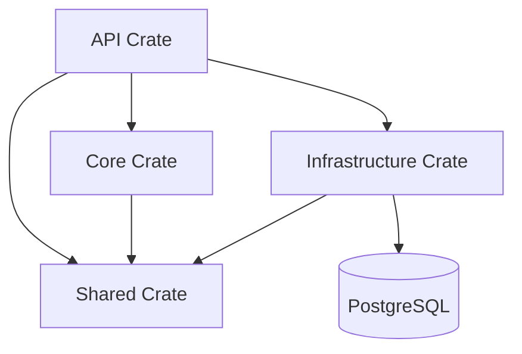

# Actix Startup Template

A modern, modular, and _scalable_ Rust web application template using the **Actix-web** framework and **SQLx**. This template is designed to accelerate the initialization process of new projects by providing a clean architecture structure and ready-to-use configuration.

## 📋 Table of Contents
- [Introduction](#-introduction)
- [Architecture](#-architecture)
- [System Prerequisites](#-system-prerequisites)
- [Installation Guide](#-installation-guide)
- [Configuration](#-configuration)
- [Running the Application](#-running-the-application)
- [Features & Modules](#-features--modules)
- [API Endpoints](#-api-endpoints)
- [Development Guide](#-development-guide)
- [Troubleshooting](#-troubleshooting)

---

## 📖 Introduction

This template was created to address the initial complexity of setting up a structured Rust project. By separating concerns between the API layer, business logic, infrastructure, and utilities, this template makes it easier for teams to collaborate and maintain code in the long term.

### Key Features
- **High Performance**: Built on Actix-web, one of the fastest web frameworks.
- **Async Database**: Uses SQLx for secure and asynchronous PostgreSQL connections.
- **Modular Workspace**: Cargo Workspace structure that isolates domain logic.
- **Connection Pooling**: Efficient database connection management with timeout and sizing configurations.
- **Environment Configuration**: Environment variable-based configuration for deployment flexibility.

---

## 🏗 Architecture

The project uses a **Cargo Workspace** structure with the following layer division:



- **`api`**: Presentation layer. Handles HTTP requests, routing, and input validation.
- **`core`** (package name: `app_core`): Domain layer. Contains pure business logic and entity definitions. Must not depend on `api` or `infrastructure`.
- **`infrastructure`**: External layer. Handles database connections, third-party API calls, and other technical implementations.
- **`shared`**: Support layer. Contains configurations, constants, error definitions, and utility functions used across layers.

---

## 💻 System Prerequisites

Before starting, ensure your system has:

- **Rust**: Latest stable version (install via [rustup](https://rustup.rs/)).
- **Docker & Docker Compose**: To run the PostgreSQL database.
- **Git**: For version management.

---

## 🚀 Installation Guide

Follow these steps to set up the project in your local environment:

1. **Clone Repository**
   ```bash
   git clone <repository-url>
   cd actix-startup-template
   ```

2. **Setup Environment Variables**
   Create a `.env` file from the provided example:
   ```bash
   cp .env.example .env
   ```
   *Note: The `.env` file is already configured to work with the default Docker setup.*

3. **Run Database**
   Use Docker Compose to run PostgreSQL:
   ```bash
   docker-compose up -d
   ```
   This will run Postgres on host port **5431** (to avoid conflict with the default port 5432).

4. **Verify Installation**
   Ensure Rust is installed and can compile the project:
   ```bash
   cargo check
   ```

---

## ⚙️ Configuration

Application configuration is managed through the `.env` file. Here are the important variables:

| Variable | Description | Default |
|----------|-------------|---------|
| `DB_HOST` | Database host | `localhost` |
| `DB_PORT` | Database port | `5431` (matches docker-compose) |
| `DB_USER` | Database username | `postgres` |
| `DB_PASSWORD` | Database password | `postgres` |
| `DB_NAME` | Database name | `postgres` |

---

## ▶️ Running the Application

### Development Mode
To run the application with hot-reload (if using `cargo-watch`) or a standard run:

```bash
# Run the API package
cargo run -p api
```

Successful output will look like:
```
[INFO  api] Starting server...
[INFO  api] Connecting to database at localhost:5431
[INFO  infrastructure::database] Creating database connection pool...
[INFO  actix_server::server] starting service: "actix-web-service-127.0.0.1:3000"
```

The application will run at `http://127.0.0.1:3000`.

### Running Tests
To run unit tests across the entire workspace:
```bash
cargo test
```

---

## ✨ Features & Modules

### 1. Database Connection Pool (`infrastructure`)
Uses `sqlx::PgPool` with the configuration:
- **Min Connections**: 2
- **Max Connections**: 10
- **Idle Timeout**: 60 seconds
- **Connect Timeout**: 30 seconds

Usage example in `api/src/main.rs`:
```rust
let db_config = DatabaseConfig::from_env();
let db = Database::new_connection(&db_config).await?;
```

### 2. Health Check (`api`)
Simple endpoint to monitor service status.
- **Location**: `api/src/routes/health.rs`
- **Response**: JSON with status and timestamp.

### 3. Shared Configuration (`shared`)
Centralized configuration struct that can be loaded from environment variables.
- **Location**: `shared/src/config/database.rs`

---

## 🔌 API Endpoints

### System
| Method | Endpoint | Description | Success Response |
|--------|----------|-------------|------------------|
| `GET`  | `/health`| Check server status | `200 OK` |

**Example Response `/health`:**
```json
{
  "status": "OK",
  "timestamp": "2025-12-15T10:15:14.190197+00:00"
}
```

---

## 💡 Development Guide

### Adding a New Route
1. Create a new handler in `api/src/routes/`.
2. Register the module in `api/src/routes/mod.rs`.
3. Add the service to `HttpServer` in `api/src/main.rs`.

### Best Practices
- **Dependency Injection**: Use `web::Data` to inject state (like DB connections) into handlers.
- **Error Handling**: Use custom error types in `shared::error` and implement Actix-web's `ResponseError` for consistent responses.
- **Testing**: Always create unit tests for business logic in `core` and handler tests in `api`.

---

## 🛠 Troubleshooting

### Common Issues

**1. `Database connection failed`**
*   **Symptom**: Application panics at startup with a connection error message.
*   **Solution**:
    *   Ensure the docker container is running: `docker ps`.
    *   Check port mapping. This template defaults to using port **5431** on the host, not 5432.
    *   Ensure credentials in `.env` match `docker-compose.yml`.

**2. `Address already in use`**
*   **Symptom**: Port bind error when running `cargo run`.
*   **Solution**:
    *   Port 3000 might be in use by another application.
    *   Change the port in `api/src/main.rs` or stop the application using that port.

**3. Compilation Error `prelude` in `core`**
*   **Symptom**: Error when importing the `core` module.
*   **Solution**:
    *   The internal package name is `app_core` (in `Cargo.toml`), not `core` (to avoid conflict with Rust's standard library). Ensure imports use `use app_core::...`.

### Help
If you find a bug or have questions, please create an *Issue* in the project repository or contact the development team.
